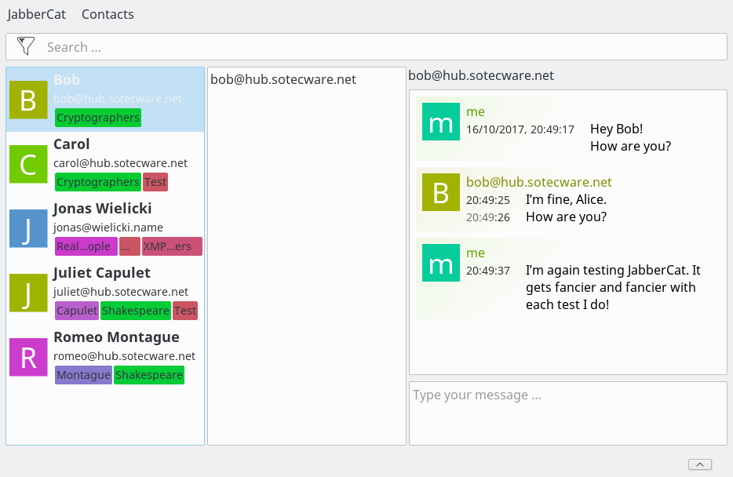

JabberCat
#########

The Jabber® client of the future!

If you are intrigued by the User Experience provided by modern, non-XMPP and/or
non-free chat applications, this is for you. We aim to provide
Conversations-like chat experience based on XMPP on the Desktop!

How to test
===========

JabberCat is still in early development phases. To test, you need to install
aioxmpp and jclib:

1. Install aioxmpp for your user::

    pip3 install --user aioxmpp

2. Clone and install jclib for your user::

    git clone https://github.com/jabbercat/jclib
    cd jclib
    pip3 install --user -e .
    cd ..

3. Clone JabberCat::

    git clone https://github.com/jabbercat/jabbercat
    cd jabbercat
    make

4. Start JabberCat::

    python3 -m jabbercat

Note: JABBER® is a registered trademark and its use is granted under a
`sublicense from the XMPP Standards Foundation <https://xmpp.org/about/xsf/jabber-trademark/approved-applications.html>`_.
