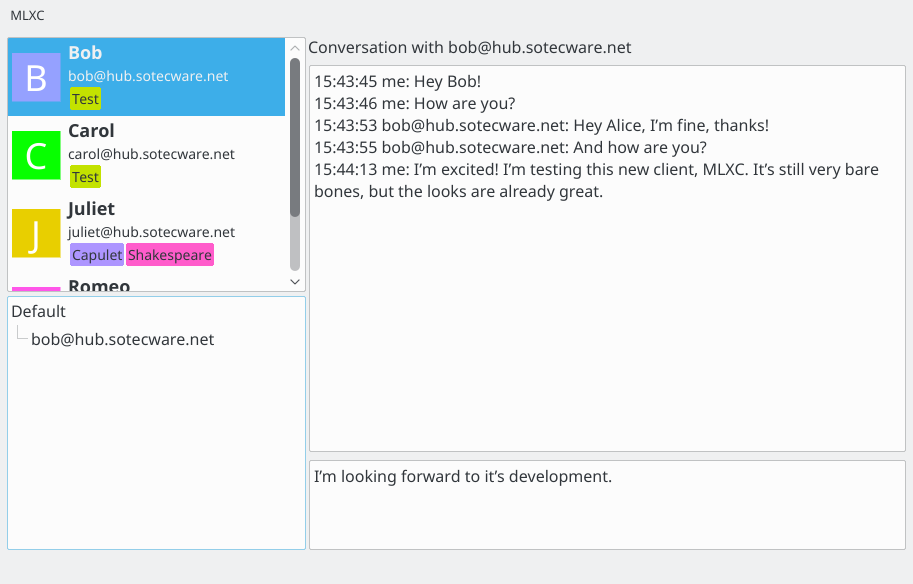

JabberCat
#########

The Jabber® client of the future!

If you are intrigued by the User Experience provided by modern, non-XMPP and/or
non-free chat applications, this is for you. We aim to provide
Conversations-like chat experience based on XMPP on the Desktop!

Note: JABBER® is a registered trademark and its use is granted under a
`sublicense from the XMPP Standards Foundation <https://xmpp.org/about/xsf/jabber-trademark/approved-applications.html>`_.
