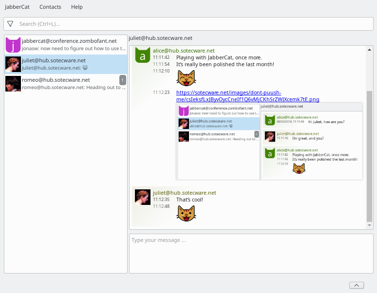

.. JabberCat documentation master file, created by
   sphinx-quickstart on Fri Oct 13 12:59:09 2017.
   You can adapt this file completely to your liking, but it should at least
   contain the root `toctree` directive.

Welcome to JabberCat!
=====================

JabberCat is an instant messenger which uses the long-established Jabber
network (based on XMPP). It is written in Python using Qt 5.

This page will at some point become a nice entry page. However, at the current
state of development, we prefer to invest manpower into actual features and
polishing the app itself. We hope you understand 😺.

(If you want to help out with that though, feel free to get in touch.)

We suggest that you head over to the :ref:`testing-guide` now.

.. toctree::
   :maxdepth: 2
   :caption: Contents:

   testing/index.rst

Contact
=======

* Join our Jabber group chat: `xmpp:jabbercat@conference.zombofant.net?join`_
* `Send an email to the lead developer <mailto:jonas@wielicki.name>`_
* Contact the lead developer via Jabber: `xmpp:jonas@wielicki.name`_. Note: Add them to your contacts first.

Indices and tables
==================

* :ref:`genindex`
* :ref:`modindex`
* :ref:`search`

Attributions
============

The screenshot features content licensed under `CC-BY-2.0 <https://creativecommons.org/licenses/by/2.0/deed.en>`_:
`Romeo & Juliet <https://commons.wikimedia.org/wiki/File:Romeo_%26_Juliet_(3640665883).jpg>`_.
